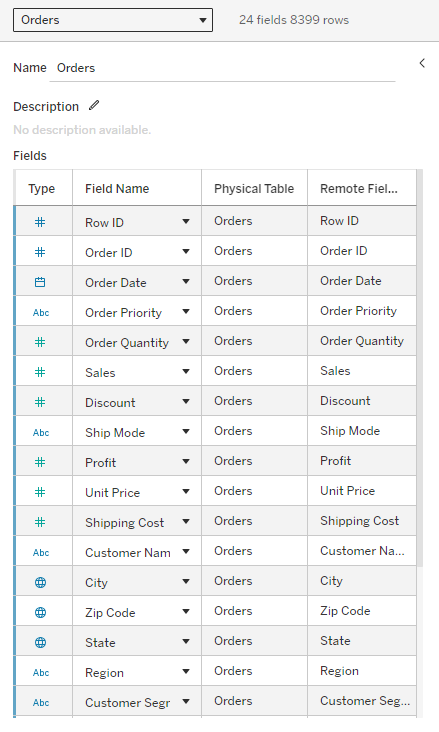
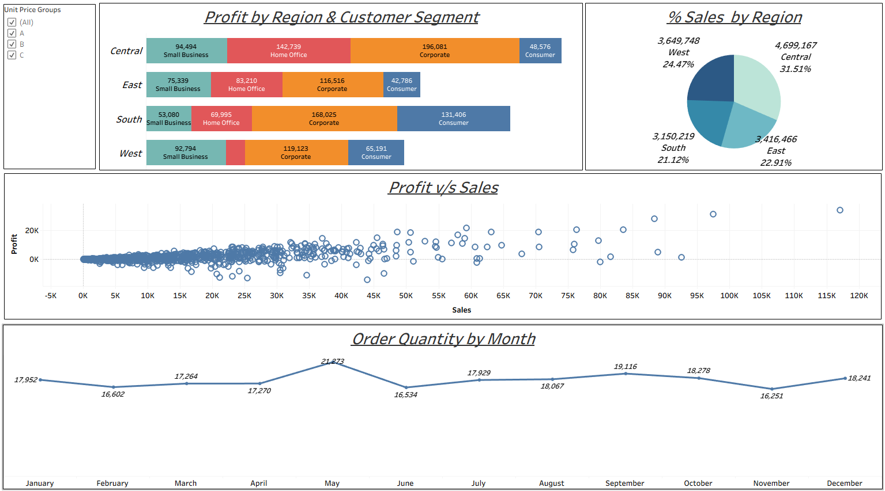

# 📊 Sales & Profit Analysis — Tableau

## 📌 Project Overview

This Tableau project analyzes an **Orders** dataset to explore sales, profit, order quantity, regional performance, and customer-segment performance.

The dashboard was built using an **Excel data source** and combines multiple Tableau visualizations with interactive filtering.

---

## 🎯 Project Objectives

- Analyze profit across different regions and customer segments.
- Compare sales performance by region.
- Examine the relationship between sales and profit.
- Analyze order quantity by month.
- Allow users to filter the analysis by Unit Price Group.

---

# 📂 Data Source

The dashboard uses an **Excel-based Orders dataset**.

The data source contains **8,399 rows and 24 fields**, including:

- Order ID
- Order Date
- Order Priority
- Order Quantity
- Sales
- Discount
- Ship Mode
- Profit
- Unit Price
- Shipping Cost
- Customer Name
- City
- State
- Region
- Customer Segment
- And other order-related fields



---

# 📊 Dashboard Analysis

## 1. 💰 Profit by Region & Customer Segment

This visualization compares profit across four regions:

- Central
- East
- South
- West

and breaks the results down by customer segment:

- Small Business
- Home Office
- Corporate
- Consumer

An interactive **Unit Price Groups** filter is also available with the categories:

- A
- B
- C



---

## 2. 🌎 Sales by Region

A regional sales breakdown is provided to compare the contribution of:

- Central
- East
- South
- West

The visualization shows both sales values and each region's percentage contribution.

---

## 3. 📈 Profit vs Sales

A scatter plot is used to examine the relationship between **Sales** and **Profit** at the order level.

This provides a view of how changes in sales value relate to profitability across individual records.

---

## 4. 📅 Order Quantity by Month

A monthly line chart shows order quantity trends from **January through December**.

This helps identify months with relatively higher or lower order volumes.

---

# 🎛️ Interactive Filtering

The dashboard includes a **Unit Price Groups** filter that allows the analysis to be viewed for:

- All
- A
- B
- C

This enables users to explore whether the observed sales and profit patterns change across the available unit-price groups.

---

# 🛠️ Skills Demonstrated

### 📊 Tableau

- Dashboard development
- Interactive filtering
- Bar charts
- Pie chart
- Scatter plot
- Line chart
- Regional analysis
- Customer-segment analysis
- Monthly trend analysis

### 📈 Business Analysis

- Sales analysis
- Profit analysis
- Regional performance
- Customer segment comparison
- Order quantity trends
- Sales vs profit relationship

### 📂 Data

- Excel data source
- Structured order-level dataset
- Multi-dimensional analysis

---

## ⚙️ Tools & Technologies

`Tableau` • `Microsoft Excel` • `Data Visualization` • `Business Analysis`

---

## 📁 Project Structure

```text
Sales-Profit-Tableau/
│
├── README.md
├── Sales-Profit-Analysis.twbx
└── images/
    ├── dashboard.png
    └── data-source.png
```

---

# ✅ Conclusion

This project demonstrates the use of **Tableau to transform an Excel-based orders dataset into an interactive sales and profit analysis dashboard**.

The report combines:

**Excel Data → Tableau Visualization → Interactive Filtering → Sales, Profit & Order Analysis**
